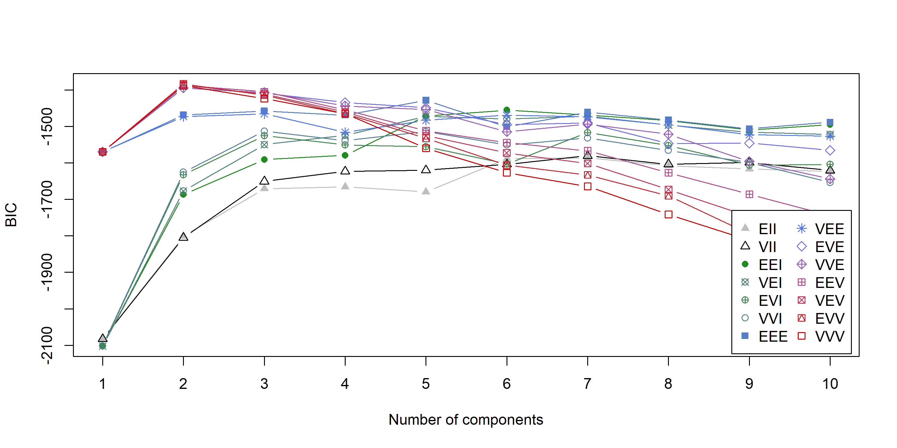

Многомерный анализ данных
================

- [1 Описание данных](#1-описание-данных)
- [2 Анализ главных компонент](#2-анализ-главных-компонент)
- [3 Факторный анализ](#3-факторный-анализ)
  - [3.1 Без поворота](#31-без-поворота)
  - [3.2 Поворот varimax](#32-поворот-varimax)
  - [3.3 Поворот oblimin (косоугольное
    вращение)](#33-поворот-oblimin-косоугольное-вращение)
- [4 Классификация](#4-классификация)
  - [4.1 LDA](#41-lda)
  - [4.2 QDA](#42-qda)
- [5 Кластеризация](#5-кластеризация)
  - [5.1 K-means](#51-k-means)
  - [5.2 Иерархическая кластеризация](#52-иерархическая-кластеризация)
  - [5.3 Модели гауссовских смесей](#53-модели-гауссовских-смесей)
  - [5.4 Спектральная кластеризация](#54-спектральная-кластеризация)
- [6 Канонический корреляционный
  анализ](#6-канонический-корреляционный-анализ)
- [7 Анализ соответствий](#7-анализ-соответствий)

``` r
# Подключаем необходимые библиотеки
library(dplyr)
library(heplots)
library(FactoMineR)
library(factoextra)
library(GGally)
library(ggrepel)
library(psych)
library(GPArotation)
library(MVN)
library(candisc)
library(MASS)
library(pROC)
library(cluster)
library(dendextend)
library(mclust)
library(Spectrum)
```

# 1 Описание данных

Для анализа будем использовать данные Ривена и Миллера (1979), которые
исследовали взаимосвязь между показателями толерантности к глюкозе и
инсулина в биохимическом анализе крови у $145$ взрослых, не страдающих
ожирением. Их исследование оказало влияние на определение стадий
развития сахарного диабета $2$-го типа. Явный сахарный диабет — это
наиболее запущенная стадия, характеризующаяся повышенной концентрацией
глюкозы в крови натощак и классическими симптомами. Предшествует явному
диабету латентная (скрытая) стадия диабета, при которой симптомы диабета
отсутствуют, но наблюдается нарушение толерантности к глюкозе при приеме
внутрь или внутривенном введении.

``` r
# Загрузка данных
data(Diabetes)
df <- Diabetes
str(df)
```

    ## 'data.frame':    145 obs. of  6 variables:
    ##  $ relwt  : num  0.81 0.95 0.94 1.04 1 0.76 0.91 1.1 0.99 0.78 ...
    ##  $ glufast: int  80 97 105 90 90 86 100 85 97 97 ...
    ##  $ glutest: int  356 289 319 356 323 381 350 301 379 296 ...
    ##  $ instest: int  124 117 143 199 240 157 221 186 142 131 ...
    ##  $ sspg   : int  55 76 105 108 143 165 119 105 98 94 ...
    ##  $ group  : Factor w/ 3 levels "Normal","Chemical_Diabetic",..: 1 1 1 1 1 1 1 1 1 1 ...

1.  ***relwt*** — относительный вес (отношение фактического веса к
    ожидаемому весу с учетом роста человека), числовой вектор
2.  ***glufast*** — уровень глюкозы в плазме крови натощак, числовой
    вектор
3.  ***glutest*** — тест уровня глюкозы в плазме, показатель
    непереносимости глюкозы, числовой вектор
4.  ***instest*** — уровень инсулина в плазме крови во время теста,
    показатель реакции инсулина на пероральный глюкозотолерантный тест,
    числовой вектор
5.  ***sspg*** — уровень глюкозы в плазме крови после некоторого времери
    после введения глюкозы, показатель резистентности к инсулину,
    числовой вектор
6.  ***group*** — диагностическая группа, фактор с уровнями Normal,
    Chemical_Diabetic и Overt_Diabetic.

``` r
# Описательная статистика
summary(df)
```

    ##      relwt           glufast       glutest          instest     
    ##  Min.   :0.7100   Min.   : 70   Min.   : 269.0   Min.   : 10.0  
    ##  1st Qu.:0.8800   1st Qu.: 90   1st Qu.: 352.0   1st Qu.:118.0  
    ##  Median :0.9800   Median : 97   Median : 413.0   Median :156.0  
    ##  Mean   :0.9773   Mean   :122   Mean   : 543.6   Mean   :186.1  
    ##  3rd Qu.:1.0800   3rd Qu.:112   3rd Qu.: 558.0   3rd Qu.:221.0  
    ##  Max.   :1.2000   Max.   :353   Max.   :1568.0   Max.   :748.0  
    ##       sspg                     group   
    ##  Min.   : 29.0   Normal           :76  
    ##  1st Qu.:100.0   Chemical_Diabetic:36  
    ##  Median :159.0   Overt_Diabetic   :33  
    ##  Mean   :184.2                         
    ##  3rd Qu.:257.0                         
    ##  Max.   :480.0

``` r
ggpairs(df, columns = 1:5, progress = FALSE)
```

<!-- -->

``` r
# Прологарифмируем признаки с хвостами
df <- df |>
  mutate(
    glufast = log(glufast),
    glutest = log(glutest),
    instest = log(instest),
    sspg = log(sspg)
  )
ggpairs(df, columns = 1:5, progress = FALSE)
```

<!-- -->

# 2 Анализ главных компонент

``` r
pca_res <- PCA(df, ncp = 5, quali.sup = 6, graph = FALSE)

# Собственные числа корреляционной матрицы (вклады компонент)
fviz_eig(pca_res, choice = "eigenvalue")
```

<!-- -->

``` r
pca_res$eig
```

    ##        eigenvalue percentage of variance cumulative percentage of variance
    ## comp 1 2.85190021              57.038004                          57.03800
    ## comp 2 1.42999281              28.599856                          85.63786
    ## comp 3 0.49246830               9.849366                          95.48723
    ## comp 4 0.17407060               3.481412                          98.96864
    ## comp 5 0.05156808               1.031362                         100.00000

Первые две главные компоненты объясняют $>80\%$ дисперсии, оставим
только их.

``` r
# Главные направления
pca_res$svd$V[, 1:2]
```

    ##            [,1]       [,2]
    ## [1,]  0.1132205  0.7227682
    ## [2,]  0.5683265 -0.1332905
    ## [3,]  0.5700594 -0.0224957
    ## [4,] -0.3651837  0.5206329
    ## [5,]  0.4537172  0.4339067

Интерпретируем главные компоненты по главным направлениям:

1.  Первая главная компонента соответствует общему состоянию пациента,
    чем больше значение, тем хуже состояние;
2.  Вторая главная компонента соответствует относительному весу
    пациента, его инсулинорезистентности и показателю реакции инсулина
    на введение глюкозы.

``` r
# Факторные нагрузки
pca_res$var$coord[, 1:2]
```

    ##              Dim.1       Dim.2
    ## relwt    0.1912019  0.86430294
    ## glufast  0.9597654 -0.15939186
    ## glutest  0.9626917 -0.02690087
    ## instest -0.6167066  0.62258487
    ## sspg     0.7662181  0.51887561

``` r
# Визуальное представление факторных нагрузок
cols <- c("#00AFBB", "#E7B800", "#FC4E07")
fviz_pca_var(pca_res, col.var = "coord", gradient.cols = cols, repel = TRUE)
```

<!-- -->

На графике видно, что признаки gluetest и gluefast практически имеют
единичную длинну и находятся рядом друг с другом. Это говорит нам о том,
что эти признаки между собой положительно коррелируют.

``` r
# Biplot (раскрасим по признаку group)
fviz_pca_biplot(pca_res, habillage = 6)
```

<!-- -->

На графике первых двух главных компонент видно, что данные разбились на
два видимых облачка: более плотное слева от оси $Oy$ и с б'ольшим
разбросом справа.

# 3 Факторный анализ

Поскольку признаков (без учета group) у нас всего пять, факторный анализ
возможно провести только по $2$ факторам. Также данные данные
неоднородные, поэтому возьмем только два класса Normal и
Chemical_Diabetic.

``` r
ggpairs(df, aes(colour = group), columns = 1:5, progress = FALSE)
```

<!-- -->

## 3.1 Без поворота

Сначала проведем факторный анализ без вращений.

``` r
x <- df |>
  filter(group != "Overt_Diabetic") |>
  droplevels() |>
  dplyr::select(-group)
fa <- factanal(x, 2, scores = "regression", rotation = "none")
fa
```

    ## 
    ## Call:
    ## factanal(x = x, factors = 2, scores = "regression", rotation = "none")
    ## 
    ## Uniquenesses:
    ##   relwt glufast glutest instest    sspg 
    ##   0.636   0.704   0.088   0.651   0.005 
    ## 
    ## Loadings:
    ##         Factor1 Factor2
    ## relwt    0.599         
    ## glufast  0.299   0.455 
    ## glutest  0.557   0.776 
    ## instest  0.565   0.173 
    ## sspg     0.997         
    ## 
    ##                Factor1 Factor2
    ## SS loadings      2.071   0.846
    ## Proportion Var   0.414   0.169
    ## Cumulative Var   0.414   0.583
    ## 
    ## Test of the hypothesis that 2 factors are sufficient.
    ## The chi square statistic is 4.97 on 1 degree of freedom.
    ## The p-value is 0.0259

P-value равен $0.0259$, при уровне значимости $0.01$ нет оснований
полагать, что $2$ факторов недостаточно. Уникальность — доля дисперсии,
которая не объясняется факторами. Видно, что полученные факторы хорошо
объясняют признаки glutest и sspg, поскольку они имеют маленькую
уникальность. Остальные признаки факторы объясняют одинакого не очень.

## 3.2 Поворот varimax

``` r
fa_varimax <- factanal(x, 2, scores = "regression", rotation = "varimax")
fa_varimax
```

    ## 
    ## Call:
    ## factanal(x = x, factors = 2, scores = "regression", rotation = "varimax")
    ## 
    ## Uniquenesses:
    ##   relwt glufast glutest instest    sspg 
    ##   0.636   0.704   0.088   0.651   0.005 
    ## 
    ## Loadings:
    ##         Factor1 Factor2
    ## relwt   0.560   0.225  
    ## glufast 0.173   0.516  
    ## glutest 0.341   0.892  
    ## instest 0.502   0.312  
    ## sspg    0.971   0.228  
    ## 
    ##                Factor1 Factor2
    ## SS loadings      1.655   1.262
    ## Proportion Var   0.331   0.252
    ## Cumulative Var   0.331   0.583
    ## 
    ## Test of the hypothesis that 2 factors are sufficient.
    ## The chi square statistic is 4.97 on 1 degree of freedom.
    ## The p-value is 0.0259

Нарисуем биплот.

``` r
biplot.psych(fa_varimax)
abline(h = 0, v = 0, lty = 2)
```

<!-- -->

Попытаемся интерпретировать факторы:

1.  Первый фактор отвечает за относительный вес человека, его
    инсулинорезистентность и инсулиновую рекцию на глюкозу.
2.  Второй фактор отвечает за уровень сахара в крови до и во время
    теста.

## 3.3 Поворот oblimin (косоугольное вращение)

При использовании косоугольных вращений важно, чтобы корреляции между
факторами были минимальными.

``` r
fa_oblimin <- factanal(
  x,
  factors = 2,
  scores = "regression",
  rotation = "oblimin"
)
fa_oblimin
```

    ## 
    ## Call:
    ## factanal(x = x, factors = 2, scores = "regression", rotation = "oblimin")
    ## 
    ## Uniquenesses:
    ##   relwt glufast glutest instest    sspg 
    ##   0.636   0.704   0.088   0.651   0.005 
    ## 
    ## Loadings:
    ##         Factor1 Factor2
    ## relwt    0.544         
    ## glufast          0.557 
    ## glutest          0.951 
    ## instest  0.440   0.216 
    ## sspg     1.012         
    ## 
    ##                Factor1 Factor2
    ## SS loadings      1.514   1.271
    ## Proportion Var   0.303   0.254
    ## Cumulative Var   0.303   0.557
    ## 
    ## Factor Correlations:
    ##         Factor1 Factor2
    ## Factor1   1.000   0.573
    ## Factor2   0.573   1.000
    ## 
    ## Test of the hypothesis that 2 factors are sufficient.
    ## The chi square statistic is 4.97 on 1 degree of freedom.
    ## The p-value is 0.0259

Как видно выше, корреляция довольно большая ($0.573$), интерпретировать
полученные факторы смысла нет. На биплоте видно, что признаки ssp,
gluefast и gluetest стали сонаправленными с ортами в плоскости факторов.

``` r
biplot.psych(fa_oblimin)
abline(h = 0, v = 0, lty = 2)
```

<!-- -->

# 4 Классификация

``` r
# Вернем группу Overt_Diabetic обратно
x <- dplyr::select(df, -group)

# Проверяем данные на нормальность
mvn_test <- MVN::mvn(x, univariateTest = "Lillie")
mvn_test$univariateNormality$Test <- "Lilliefors"
mvn_test$univariateNormality
```

    ##         Test  Variable Statistic   p value Normality
    ## 1 Lilliefors   relwt      0.0579  0.2741      YES   
    ## 2 Lilliefors  glufast     0.2549  <0.001      NO    
    ## 3 Lilliefors  glutest     0.1689  <0.001      NO    
    ## 4 Lilliefors  instest     0.1344  <0.001      NO    
    ## 5 Lilliefors   sspg       0.0863  0.0102      NO

``` r
# Multivariate ANOVA, проверка значимости различия в средних
manova_res <- manova(as.matrix(x) ~ group, data = df)

# Wilks' Lambda
summary(manova_res, "Wilks")
```

    ##            Df    Wilks approx F num Df den Df    Pr(>F)    
    ## group       2 0.077013   71.855     10    276 < 2.2e-16 ***
    ## Residuals 142                                              
    ## ---
    ## Signif. codes:  0 '***' 0.001 '**' 0.01 '*' 0.05 '.' 0.1 ' ' 1

``` r
# Roy's Largest Root
summary(manova_res, "Roy")
```

    ##            Df   Roy approx F num Df den Df    Pr(>F)    
    ## group       2 6.431   178.78      5    139 < 2.2e-16 ***
    ## Residuals 142                                           
    ## ---
    ## Signif. codes:  0 '***' 0.001 '**' 0.01 '*' 0.05 '.' 0.1 ' ' 1

По критерию MANOVA классы имеют значимо разные векторы средних.

``` r
# Канонический дискриминантный анализ
ca <- candisc(manova_res)
summary(ca, coef = "structure")
```

    ## 
    ## Canonical Discriminant Analysis for group:
    ## 
    ##    CanRsq Eigenvalue Difference Percent Cumulative
    ## 1 0.86543    6.43099     5.6836  89.588     89.588
    ## 2 0.42772    0.74739     5.6836  10.412    100.000
    ## 
    ## Class means:
    ## 
    ##                       Can1     Can2
    ## Normal             2.08199 -0.40093
    ## Chemical_Diabetic -0.58009  1.47547
    ## Overt_Diabetic    -4.16206 -0.68623
    ## 
    ##  structure coefficients:
    ##             Can1     Can2
    ## relwt   -0.20394  0.50168
    ## glufast -0.88191 -0.45112
    ## glutest -0.98760 -0.15100
    ## instest  0.40468  0.72531
    ## sspg    -0.77365  0.21080

``` r
plot(ca)
```

<!-- -->

Канонические переменные являются линейными комбинации признаков, которые
наилучшим образом различают группы. Стрелочки — корелляции между
признаками и каноническими переменными. Тогда канонические переменные
можно интерпретировать следующим образом: первая каноническая переменная
соответствует уровню глюкозы индивида (до, во время и после теста),
вторая — относительному весу и реакции инсулина на глюкозу.

## 4.1 LDA

``` r
# Обучаем LDA на всех данных
lda_pred <- df |>
  lda(group ~ ., data = _) |>
  predict(x)
```

``` r
confusion_matrix <- function(pred, response) {
  cm <- table(Predicted = pred, Actual = response)
  print(cm)
  cat(
    "\nAccuracy:", sum(diag(cm)) / nrow(df),
    "\nAccuracy in each class:", diag(prop.table(cm, 2))
  )
  invisible(cm)
}
```

``` r
confusion_matrix(lda_pred$class, df$group)
```

    ##                    Actual
    ## Predicted           Normal Chemical_Diabetic Overt_Diabetic
    ##   Normal                72                 1              0
    ##   Chemical_Diabetic      4                35              7
    ##   Overt_Diabetic         0                 0             26
    ## 
    ## Accuracy: 0.9172414 
    ## Accuracy in each class: 0.9473684 0.9722222 0.7878788

Поскольку данных мало, вместо разделения данных на train и test лучше
воспользоваться leave-one-out кросс-валидацией.

``` r
# Leave-one-out CV
lda_cv <- lda(group ~ ., data = df, CV = TRUE)
```

``` r
confusion_matrix(lda_cv$class, df$group)
```

    ##                    Actual
    ## Predicted           Normal Chemical_Diabetic Overt_Diabetic
    ##   Normal                71                 2              0
    ##   Chemical_Diabetic      5                34              7
    ##   Overt_Diabetic         0                 0             26
    ## 
    ## Accuracy: 0.9034483 
    ## Accuracy in each class: 0.9342105 0.9444444 0.7878788

Пусть теперь пациенты с латентным диабетом являются контрольной группой,
посмотрим на качество классификации.

``` r
df_control <- df |>
  mutate(control = factor(group == "Chemical_Diabetic", labels = c(0, 1))) |>
  dplyr::select(-group)
cat("Proportion of the control group:", mean(df_control$control == 1))
```

    ## Proportion of the control group: 0.2482759

Поскольку нам важно правильно диагностировать латентный диабет,
установим одинаковые априорные веса.

``` r
# Leave-one-out CV на данных с контрольной группой
lda_control_cv <- lda(
  control ~ .,
  data = df_control,
  prior = c(0.5, 0.5),
  CV = TRUE
)
```

``` r
confusion_matrix(lda_control_cv$class, df_control$control)
```

    ##          Actual
    ## Predicted  0  1
    ##         0 93  3
    ##         1 16 33
    ## 
    ## Accuracy: 0.8689655 
    ## Accuracy in each class: 0.853211 0.9166667

Теперь построим ROC-кривую.

``` r
# Строим ROC-кривые
roc_lda <- roc(df_control$control, lda_control_cv$posterior[, 2], quiet = TRUE)
plot(roc_lda, print.auc = TRUE, legacy.axes = TRUE)
```

<!-- -->

По оси $Ox$ отложена специфичность, по оси $Oy$ — чувствительность.
Специфичность — доля верно предсказанных отрицательных результатов (1 -
FPR), чувствительность — доля верно предсказанных положительных
результатов (TPR). AUC — площадь под графиком, чем больше, тем лучше
классификатор. Получили довольно хороший классификатор.

## 4.2 QDA

Проделаем все тоже самое для QDA.

``` r
# Обучаем QDA на всех данных
qda_pred <- df |>
  qda(group ~ ., data = _) |>
  predict(x)
```

``` r
confusion_matrix(qda_pred$class, df$group)
```

    ##                    Actual
    ## Predicted           Normal Chemical_Diabetic Overt_Diabetic
    ##   Normal                74                 2              0
    ##   Chemical_Diabetic      2                34              1
    ##   Overt_Diabetic         0                 0             32
    ## 
    ## Accuracy: 0.9655172 
    ## Accuracy in each class: 0.9736842 0.9444444 0.969697

``` r
# Leave-one-out CV
qda_cv <- qda(group ~ ., data = df, CV = TRUE)
```

``` r
confusion_matrix(qda_cv$class, df$group)
```

    ##                    Actual
    ## Predicted           Normal Chemical_Diabetic Overt_Diabetic
    ##   Normal                73                 2              0
    ##   Chemical_Diabetic      3                32              2
    ##   Overt_Diabetic         0                 2             31
    ## 
    ## Accuracy: 0.937931 
    ## Accuracy in each class: 0.9605263 0.8888889 0.9393939

``` r
# Leave-one-out CV на данных с контрольной группой
qda_control_cv <- qda(
  control ~ .,
  data = df_control,
  prior = c(0.5, 0.5),
  CV = TRUE
)
```

``` r
confusion_matrix(qda_control_cv$class, df_control$control)
```

    ##          Actual
    ## Predicted   0   1
    ##         0 103   2
    ##         1   6  34
    ## 
    ## Accuracy: 0.9448276 
    ## Accuracy in each class: 0.9449541 0.9444444

``` r
# Строим ROC-кривые
roc_qda <- roc(df_control$control, qda_control_cv$posterior[, 2], quiet = TRUE)
plot(roc_qda, print.auc = TRUE, legacy.axes = TRUE)
```

<!-- -->

Сравним LDA и QDA.

``` r
plot(
  roc_lda,
  col = "red",
  print.auc = TRUE,
  legacy.axes = TRUE
)
plot(
  roc_qda,
  add = TRUE,
  col = "blue",
  print.auc = TRUE,
  print.auc.adj = c(0, 3)
)
# Добавляем легенду
legend(
  "bottomright",
  c("LDA", "QDA"),
  col = c("red", "blue"),
  lwd = 2,
  bty = "n"
)
```

<!-- -->

Выбираем модель с большим AUC — QDA.

# 5 Кластеризация

На глаз можно выделить 2 кластера: первый соответствует группам Normal и
Chemical_Diabetic, второй — Overt_diabetic. В качестве внешней оценки
качества кластеризации возьмем индекс Adjusted Rand, а в качестве
внутренней — Silhouette.

Перед тем, как применять кластеризацию, стандартизуем признаки.

``` r
clust <- df$group
levels(clust) <- c(1, 1, 2)
df_scaled <- df |>
  dplyr::select(-group) |>
  scale()
ggpairs(df_scaled, aes(colour = clust), progress = FALSE)
```

<!-- -->

``` r
silhouettes <- list()
adj_rand <- list()
d <- dist(df_scaled)
```

## 5.1 K-means

``` r
fviz_nbclust(df_scaled, kmeans)
```

<!-- -->

``` r
set.seed(4)
clust_kmeans <- kmeans(df_scaled, 2)
```

Визуализация k-means clustering:

``` r
ggpairs(df_scaled, aes(colour = factor(clust_kmeans$cluster)), progress = FALSE)
```

<!-- -->

Также посмотрим на плоскость первых двух главных компонент

``` r
fviz_cluster(clust_kmeans, df_scaled, ellipse.type = "norm")
```

<!-- -->

``` r
silhouettes$kmeans <- mean(silhouette(clust_kmeans$cluster, d)[, 3])
adj_rand$kmeans <- adjustedRandIndex(clust_kmeans$cluster, clust)

cat(
  "Silhouette: ", silhouettes$kmeans,
  "\nAdjusted Rand Index:", adj_rand$kmeans
)
```

    ## Silhouette:  0.500388 
    ## Adjusted Rand Index: 0.8197211

## 5.2 Иерархическая кластеризация

``` r
dend <- hclust(d, method = "ward.D") |>
  as.dendrogram()

# Раскрасим листья
colors_dend <- as.numeric(clust)
colors_dend <- colors_dend[order.dendrogram(dend)]
labels_colors(dend) <- colors_dend

plot(dend, main = "Dendrogram", ylab = "Euclidean distance")
# Середина максимального расстояния между узлами
abline(h = 55, lty = 2)
```

<!-- -->

Обычно дерево обрезают по середина максимального расстояния между
узлами, т.е. в данном случае остается $2$ кластера. Посмотрим, что
скажет Silhouette.

``` r
hclust_results <- c()
ks <- 2:10

for (i in seq_along(ks)) {
  hc <- cutree(dend, k = ks[i])
  hclust_results[i] <- mean(silhouette(hc, d)[, 3])
}

plot(
  c(1, ks), c(0, hclust_results),
  type = "b",
  xlab = "Number of clusters", ylab = "Silhouette",
  xaxt = "n"
)
axis(1, c(1, ks))
abline(v = 2, lty = 2)
```

<!-- -->

По Silhouette оптимальное количество кластеров тоже $2$. Визуализируем
полученную кластеризации:

``` r
clust_hierar <- cutree(dend, k = 2)
ggpairs(df_scaled, aes(colour = factor(clust_hierar)), progress = FALSE)
```

<!-- -->

``` r
fviz_cluster(list(data = df_scaled, cluster = factor(clust_hierar)), ellipse.type = "norm")
```

<!-- -->

``` r
silhouettes$hclust <- mean(silhouette(clust_hierar, d)[, 3])
adj_rand$hclust <- adjustedRandIndex(clust_hierar, clust)
cat(
    "Silhouette: ", silhouettes$hclust,
    "\nAdjusted Rand Index:", adj_rand$hclust
)
```

    ## Silhouette:  0.500388 
    ## Adjusted Rand Index: 0.8197211

## 5.3 Модели гауссовских смесей

``` r
mclust_res <- Mclust(df_scaled, 1:10)

# Plot BIC
plot(mclust_res, what = c("BIC"))
```

<!-- -->

``` r
mclust_res$BIC
```

    ## Bayesian Information Criterion (BIC): 
    ##          EII       VII       EEI       VEI       EVI       VVI       EEE
    ## 1  -2082.304 -2082.304 -2102.211 -2102.211 -2102.211 -2102.211 -1569.685
    ## 2  -1800.862 -1804.932 -1686.987 -1677.131 -1632.583 -1625.335 -1468.454
    ## 3  -1670.823 -1650.638 -1590.505 -1549.781 -1524.949 -1512.826 -1457.933
    ## 4  -1665.919 -1622.834 -1579.253 -1524.167 -1550.678 -1539.039 -1468.986
    ## 5  -1679.350 -1620.045 -1471.281 -1471.880 -1555.391 -1513.513 -1428.221
    ## 6  -1587.884 -1603.733 -1455.246 -1479.759 -1602.892 -1550.995 -1500.853
    ## 7  -1586.477 -1580.241 -1468.326 -1471.913 -1516.824 -1531.544 -1460.791
    ## 8  -1607.484 -1603.759 -1484.095 -1496.375 -1552.484 -1565.570 -1482.337
    ## 9  -1616.448 -1598.825 -1509.639 -1515.874 -1606.056 -1598.798 -1506.362
    ## 10 -1623.426 -1620.674 -1494.653 -1521.707 -1604.295 -1653.675 -1488.448
    ##          VEE       EVE       VVE       EEV       VEV       EVV       VVV
    ## 1  -1569.685 -1569.685 -1569.685 -1569.685 -1569.685 -1569.685 -1569.685
    ## 2  -1472.712 -1394.204 -1394.405 -1387.354 -1386.303 -1383.350 -1388.314
    ## 3  -1465.230 -1408.523 -1406.738 -1404.778 -1411.200 -1413.958 -1423.827
    ## 4  -1516.130 -1434.060 -1443.719 -1454.157 -1460.190 -1464.981 -1464.734
    ## 5  -1483.035 -1448.727 -1453.446 -1511.639 -1525.468 -1532.484 -1559.926
    ## 6  -1469.323 -1494.847 -1514.326 -1544.411 -1572.590 -1605.916 -1626.739
    ## 7  -1473.705 -1490.434 -1493.379 -1566.737 -1601.639 -1632.730 -1664.202
    ## 8  -1495.550 -1546.935 -1521.434 -1626.973 -1673.140 -1690.027 -1741.159
    ## 9  -1522.722 -1545.643 -1595.839 -1685.972 -1746.628 -1794.217 -1812.101
    ## 10 -1526.644 -1565.586 -1643.925 -1744.685 -1783.536 -1847.831        NA
    ## 
    ## Top 3 models based on the BIC criterion: 
    ##     EVV,2     VEV,2     EEV,2 
    ## -1383.350 -1386.303 -1387.354

Из всех моделей больший BIC имют модели EVV, VEV и EEV с $2$ кластерами.
Выбираем модель с меньшим значением параметров — EEV.

``` r
gmm_eev <- Mclust(df_scaled, 2, "EEV")
```

Визуализируем полученную кластеризацию. Сначала вглянем на pairs plot.

``` r
plot(gmm_eev, what = "classification")
```

<!-- -->

Теперь на плоскость первых двух главных компонент:

``` r
fviz_cluster(gmm_eev, df_scaled, ellipse.type = "norm")
```

<!-- -->

``` r
silhouettes$mclust <- mean(silhouette(gmm_eev$classification, d)[, 3])
adj_rand$mclust <- adjustedRandIndex(gmm_eev$classification, clust)
cat(
  "Silhouette: ", silhouettes$mclust,
  "\nAdjusted Rand Index:", adj_rand$mclust
)
```

    ## Silhouette:  0.3886097 
    ## Adjusted Rand Index: 0.7764606

## 5.4 Спектральная кластеризация

Зафиксируем количество кластеров $k=2$.

``` r
spectral_clust <- df_scaled |>
  t() |>
  data.frame() |>
  Spectrum(silent = TRUE, clusteralg = "km", method = 3, fixk = 2)
```

Визуализируем:

``` r
df_scaled |>
  ggpairs(aes(colour = factor(spectral_clust$assignments)), progress = FALSE)
```

<!-- -->

``` r
fviz_cluster(list(data = df_scaled, cluster = spectral_clust$assignments), ellipse.type = "norm")
```

<!-- -->

``` r
silhouettes$spec <- mean(silhouette(spectral_clust$assignments, d)[, 3])
adj_rand$spec <- adjustedRandIndex(spectral_clust$assignments, clust)
cat(
  "Silhouette: ", silhouettes$spec,
  "\nAdjusted Rand Index:", adj_rand$spec
)
```

    ## Silhouette:  0.4873895 
    ## Adjusted Rand Index: 0.8794391

Сравним полученные метрики.

``` r
data.frame(
  Silhouette = unlist(silhouettes),
  AdjustedRand = unlist(adj_rand)
)
```

    ##        Silhouette AdjustedRand
    ## kmeans  0.5003880    0.8197211
    ## hclust  0.5003880    0.8197211
    ## mclust  0.3886097    0.7764606
    ## spec    0.4873895    0.8794391

По внутренней мере оценки качества кластеризации самыми лучшими
оказались k-means и иерархическая кластеризация, по внешней мере —
спектральная кластеризация. Худшая по обоим мерам — модель гауссовских
смесей.

# 6 Канонический корреляционный анализ

Будем рассматривать только однородные данные, то есть опять уберем
группу Overt_Diabetic. Выявим зависимость между исходыми данными
пациента (его вес и уровень крови натошак) и результатами теста.

``` r
x <- df |>
  filter(group != "Overt_Diabetic") |>
  droplevels()

cancor_res <- cancor(
  x |> dplyr::select(relwt, glufast),
  x |> dplyr::select(glutest, instest, sspg)
)
summary(cancor_res)
```

    ## 
    ## Canonical correlation analysis of:
    ##   2   X  variables:  relwt, glufast 
    ##   with    3   Y  variables:  glutest, instest, sspg 
    ## 
    ##     CanR CanRSQ  Eigen percent    cum                          scree
    ## 1 0.6431 0.4136 0.7054   79.47  79.47 ******************************
    ## 2 0.3927 0.1542 0.1823   20.53 100.00 ********                      
    ## 
    ## Test of H0: The canonical correlations in the 
    ## current row and all that follow are zero
    ## 
    ##      CanR LR test stat approx F numDF denDF   Pr(> F)    
    ## 1 0.64315      0.49595   14.979     6   214 2.735e-14 ***
    ## 2 0.39266      0.84582      NaN     2   NaN       NaN    
    ## ---
    ## Signif. codes:  0 '***' 0.001 '**' 0.01 '*' 0.05 '.' 0.1 ' ' 1
    ## 
    ## Raw canonical coefficients
    ## 
    ##    X  variables: 
    ##           Xcan1   Xcan2
    ## relwt   -5.9405 -5.3227
    ## glufast -4.1417  9.5921
    ## 
    ##    Y  variables: 
    ##            Ycan1    Ycan2
    ## glutest -2.52727  5.46088
    ## instest  0.39646  0.32901
    ## sspg    -1.33401 -1.79598

``` r
# Корреляция между исходными признаками и каноническими переменными
cancor_res$structure
```

    ## $X.xscores
    ##              Xcan1      Xcan2
    ## relwt   -0.9180733 -0.3964106
    ## glufast -0.6673165  0.7447742
    ## 
    ## $Y.xscores
    ##              Xcan1       Xcan2
    ## glutest -0.5203522  0.22995296
    ## instest -0.2946826  0.02572774
    ## sspg    -0.5869403 -0.14298225
    ## 
    ## $X.yscores
    ##             Ycan1      Ycan2
    ## relwt   -0.590458 -0.1556542
    ## glufast -0.429184  0.2924423
    ## 
    ## $Y.yscores
    ##              Ycan1       Ycan2
    ## glutest -0.8090693  0.58563014
    ## instest -0.4581871  0.06552184
    ## sspg    -0.9126038 -0.36413845

``` r
# Канонические коэффициенты
coef(cancor_res, type = "both", standardize = TRUE)
```

    ## [[1]]
    ##              Xcan1      Xcan2
    ## relwt   -0.7853876 -0.7037060
    ## glufast -0.4180274  0.9681369
    ## 
    ## [[2]]
    ##              Ycan1      Ycan2
    ## glutest -0.4899461  1.0586694
    ## instest  0.1855681  0.1539971
    ## sspg    -0.7545713 -1.0158804

``` r
# Визуализация многомерной множественной регрессии
plot(cancor_res)
```

<!-- -->

``` r
plot(cancor_res, which = 2)
```

<!-- -->

# 7 Анализ соответствий

Рассмотрим данные о зарегистрированных случаях преступлений (за
исключением убийств), которые произошли в Чикаго в 2012-2017 гг.

``` r
df_crimes <- read.csv("./data/crimes2012_2017.csv", TRUE, ";")
str(df_crimes)
```

    ## 'data.frame':    1456714 obs. of  3 variables:
    ##  $ ID                  : int  10508693 10508695 10508697 10508698 10508699 10508702 10508703 10508704 10508709 10508982 ...
    ##  $ Primary.Type        : chr  "BATTERY" "BATTERY" "PUBLIC PEACE VIOLATION" "BATTERY" ...
    ##  $ Location.Description: chr  "APARTMENT" "RESIDENCE" "STREET" "SIDEWALK" ...

Нас интересуют признаки Primary.Type (вид преступления) и
Location.Description (место преступления).

``` r
# Number of unique values
df_crimes |> summarise_all(n_distinct)
```

    ##        ID Primary.Type Location.Description
    ## 1 1456714           33                  143

Поскольку у признаков довольно много уникальных значений, возьмем только
первые $10$ самых распространенных.

``` r
crime_type <- df_crimes |>
  group_by(Primary.Type) |>
  summarise(count = n()) |>
  arrange(desc(count)) |>
  head(10) |>
  _$Primary.Type

crime_type
```

    ##  [1] "THEFT"               "BATTERY"             "CRIMINAL DAMAGE"    
    ##  [4] "NARCOTICS"           "ASSAULT"             "OTHER OFFENSE"      
    ##  [7] "BURGLARY"            "DECEPTIVE PRACTICE"  "MOTOR VEHICLE THEFT"
    ## [10] "ROBBERY"

``` r
crime_loc <- df_crimes |>
  group_by(Location.Description) |>
  summarise(count = n()) |>
  arrange(desc(count)) |>
  head(10) |>
  _$Location.Description

crime_loc
```

    ##  [1] "STREET"                         "RESIDENCE"                     
    ##  [3] "APARTMENT"                      "SIDEWALK"                      
    ##  [5] "OTHER"                          "PARKING LOT/GARAGE(NON.RESID.)"
    ##  [7] "ALLEY"                          "RESIDENTIAL YARD (FRONT/BACK)" 
    ##  [9] "SMALL RETAIL STORE"             "SCHOOL, PUBLIC, BUILDING"

Составим таблицу сопряженности.

``` r
contingency_table <- df_crimes |>
  dplyr::select(Primary.Type, Location.Description) |>
  filter(Primary.Type %in% crime_type & Location.Description %in% crime_loc) |>
  table()
```

``` r
ca_res <- CA(contingency_table, graph = FALSE)
get_eigenvalue(ca_res)
```

    ##         eigenvalue variance.percent cumulative.variance.percent
    ## Dim.1 2.660393e-01      49.64718499                    49.64718
    ## Dim.2 1.775810e-01      33.13944692                    82.78663
    ## Dim.3 5.113645e-02       9.54287741                    92.32951
    ## Dim.4 3.099208e-02       5.78361607                    98.11313
    ## Dim.5 7.092462e-03       1.32356663                    99.43669
    ## Dim.6 1.937470e-03       0.36156279                    99.79825
    ## Dim.7 7.354716e-04       0.13725072                    99.93551
    ## Dim.8 2.839828e-04       0.05299572                    99.98850
    ## Dim.9 6.161719e-05       0.01149875                   100.00000

``` r
fviz_eig(ca_res, addlabels = TRUE)
```

<!-- -->

Первые 2-3 компоненты уже достаточно хорошо (82-92% объясненной
дисперсии) описывают данные. Взглянем на биплот первых двух компонент.

``` r
fviz_ca_biplot(ca_res)
```

<!-- -->

На биплоте близость столбцов и строк означает положительную связь. По
графику видим, что на пешеходных дорогах и переулках происходят кражи и
распространение наркотиков; в школах, общенственных местах и зданиях
происходят нападения (угрозы физического насилия) и побои; в местах
проживания происходят акты мошенничества (видимо, телефонного) и взломы
с проникновением.
